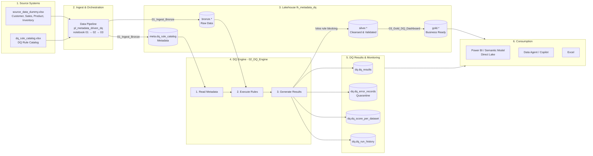
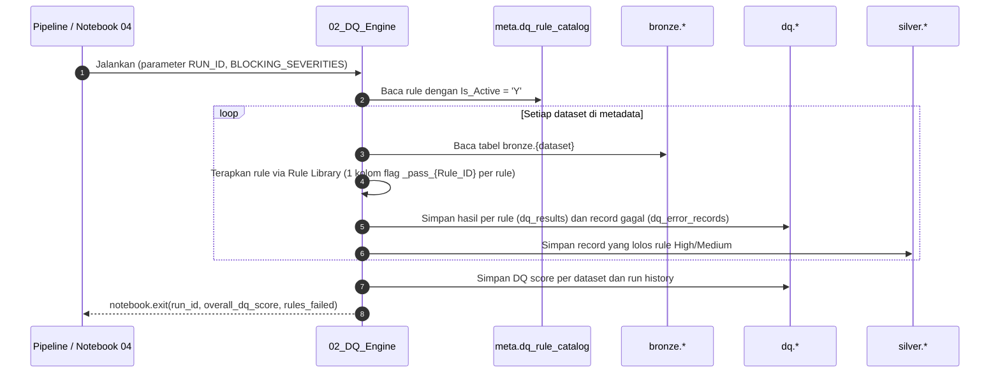
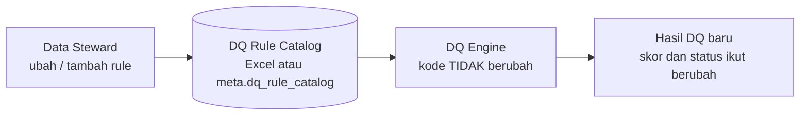

# Demo: Metadata Driven Framework untuk Data Quality di Microsoft Fabric

> Satu framework untuk banyak dataset, dikendalikan oleh **metadata (konfigurasi)**, tanpa hard-code.

| Item | Nilai |
|---|---|
| Workspace | `ws_fabric_metadata_driven_dq` |
| Lakehouse | `lh_metadata_dq` (Lakehouse schemas: `bronze`, `silver`, `gold`, `meta`, `dq`) |
| Pipeline | `pl_metadata_driven_dq` (01 → 02 → 03) |
| Notebook | `01_Ingest_Bronze`, `02_DQ_Engine`, `03_Gold_DQ_Dashboard`, `04_Demo_Change_Metadata` |

## Arsitektur (mengikuti diagram)



### Alur kerja DQ Engine



### Konsep: ubah metadata, bukan kode



## Isi folder

| Path | Keterangan |
|---|---|
| [data/source_data_dummy.xlsx](data/source_data_dummy.xlsx) | Data dummy 4 dataset: Customer (1.000), Sales (5.000), Product (200), Inventory (600) - sengaja berisi error |
| [data/dq_rule_catalog.xlsx](data/dq_rule_catalog.xlsx) | **Tabel Metadata (DQ Rule Catalog)** - 12 rule (11 aktif, 1 non-aktif) |
| [scripts/generate_dummy_data.py](scripts/generate_dummy_data.py) | Generator data dummy & rule catalog |
| [scripts/deploy_to_fabric.py](scripts/deploy_to_fabric.py) | Deploy otomatis (upload Excel, notebook, pipeline) via Fabric REST API |
| [notebooks/](notebooks/) | Source notebook (`.py` percent-format, mudah dibaca/di-review) + `.ipynb` yang di-deploy |

## Tabel Metadata (DQ Rule Catalog)

| Kolom | Arti |
|---|---|
| `Rule_ID` | ID unik rule, juga dipakai sebagai `Error_Code` |
| `Dataset` / `Column` | Target validasi (tabel `bronze.<dataset>`) |
| `Rule_Type` | `NOT_NULL`, `VALID_FORMAT` (regex), `UNIQUE`, `RANGE` (`min\|max`), `VALID_VALUE` (`A,B,C`), `REFERENTIAL` (`Dataset.Kolom`), `CUSTOM_SQL` (ekspresi SQL) |
| `Rule_Parameter` | Parameter rule sesuai tipe |
| `Threshold` | Minimal % record lolos agar status rule = **PASS** |
| `Severity` | `High`/`Medium` = **blocking** (record dikarantina, tidak masuk Silver); `Low` = warning saja |
| `Owner`, `Description` | Pemilik rule & pesan error |
| `Is_Active` | `Y`/`N` - nonaktifkan rule tanpa ubah kode |

## Output tabel

| Tabel | Isi |
|---|---|
| `dq.dq_results` | Hasil per rule per eksekusi: Total, Failed, Pass %, Threshold, Status (PASS/FAIL) |
| `dq.dq_error_records` | **Quarantine** - detail record gagal: Dataset, Column, Value, Error_Code, Error_Message, Record (JSON) |
| `dq.dq_score_per_dataset` | DQ Score per dataset (rata-rata Pass %) |
| `dq.dq_run_history` | Metadata eksekusi: Run_ID, waktu, durasi, jumlah rule, Overall DQ Score |
| `silver.*` | Data yang lolos rule blocking |
| `gold.sales_by_category_month`, `gold.customer_sales_summary` | Data business-ready dari Silver |

## Skenario demo (± 15 menit)

1. **Tunjukkan masalahnya** - buka `source_data_dummy.xlsx`: ada email salah, Amount negatif, transaksi duplikat, dll.
2. **Tunjukkan metadata** - buka `dq_rule_catalog.xlsx`: semua aturan DQ hanyalah *baris data*.
3. **Jalankan pipeline** `pl_metadata_driven_dq` (atau notebook 01 → 02 → 03 satu per satu).
4. **Bahas engine** di `02_DQ_Engine`: satu loop generik + *Rule Library* (1 fungsi per `Rule_Type`).
5. **Lihat hasil** di `03_Gold_DQ_Dashboard`: Overall DQ Score, DQ Score per Dataset, Rule Validation Detail, Error Record (Quarantine).
6. **"Aha moment"** - jalankan `04_Demo_Change_Metadata`: aktifkan DQ012, tambah DQ013/DQ014, ubah threshold DQ004 → engine yang **sama** menghasilkan skor berbeda. *Tanpa mengubah kode.*
7. **(Opsional) Power BI** - di Lakehouse → *New semantic model* → pilih tabel `dq.*` → buat report (gauge Overall DQ Score, bar per dataset, tabel detail rule & error).

> Catatan: notebook `01_Ingest_Bronze` memuat ulang rule catalog dari Excel setiap pipeline jalan. Perubahan via notebook 04 bersifat sementara sampai pipeline berikutnya; untuk perubahan permanen, ubah Excel (atau jadikan tabel `meta.dq_rule_catalog` sebagai *source of truth*).

## Deploy ulang / dari nol

```powershell
az login                                   # login dengan user yang punya akses ke workspace
python scripts/generate_dummy_data.py      # (opsional) regenerate data dummy
python scripts/deploy_to_fabric.py --run   # upload + create/update notebook & pipeline + jalankan pipeline
```

Workspace dan Lakehouse (`enableSchemas: true`) harus sudah ada (sudah dibuat untuk demo ini).

## Mengapa Metadata Driven?

1. **Scalability** - satu engine untuk ratusan hingga ribuan dataset.
2. **Maintainability** - aturan dikelola di metadata, bukan di kode.
3. **Reusability** - Rule Library dipakai ulang untuk semua dataset.
4. **Consistency** - standar & format hasil yang sama untuk semua dataset.
5. **Faster Delivery** - dataset baru = tambah baris konfigurasi.

## Referensi (Microsoft Learn)

- [Medallion lakehouse architecture in Microsoft Fabric](https://learn.microsoft.com/fabric/onelake/onelake-medallion-lakehouse-architecture)
- [Data quality in materialized lake views](https://learn.microsoft.com/fabric/data-engineering/materialized-lake-views/data-quality) - alternatif deklaratif (`CONSTRAINT ... CHECK ... ON MISMATCH DROP`)
- [Lakehouse schemas](https://learn.microsoft.com/fabric/data-engineering/lakehouse-schemas)
- [NotebookUtils (notebook.run / exit)](https://learn.microsoft.com/fabric/data-engineering/notebook-utilities)
- [Notebook activity di Data Pipeline](https://learn.microsoft.com/fabric/data-factory/notebook-activity)
- [Direct Lake semantic model](https://learn.microsoft.com/fabric/fundamentals/direct-lake-overview)
