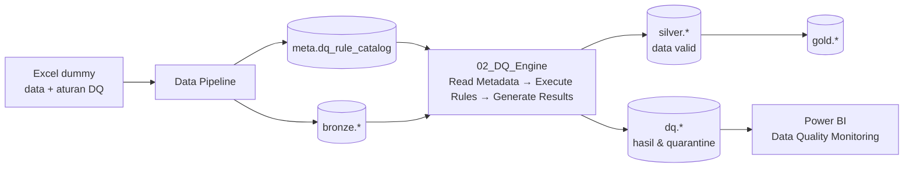
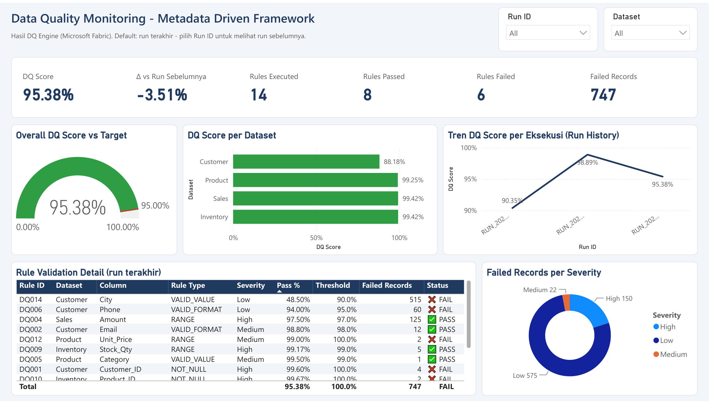
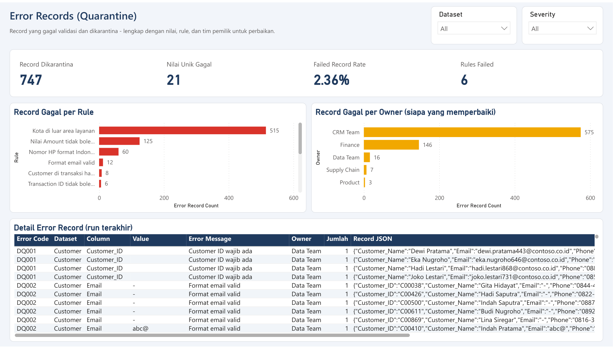
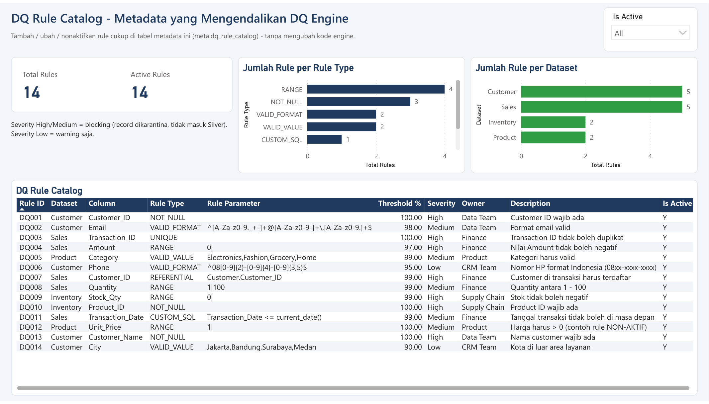

# Tutorial: Membangun Metadata Driven Data Quality Framework di Microsoft Fabric

Tutorial ini mengajak Anda membangun **satu framework Data Quality (DQ) untuk banyak dataset** di Microsoft Fabric, yang dikendalikan oleh **metadata (tabel aturan)**, bukan oleh kode yang di-hard-code. Di akhir tutorial Anda akan memiliki:

- Lakehouse dengan medallion architecture (`bronze` → `silver` → `gold`) + schema `meta` (aturan DQ) dan `dq` (hasil DQ).
- **DQ Engine** generik (1 notebook) yang membaca aturan dari metadata lalu memvalidasi semua dataset.
- Tabel hasil: skor DQ per rule & per dataset, **record yang dikarantina (quarantine)**, dan history eksekusi.
- Data Pipeline untuk orkestrasi, dan **report Power BI (Direct Lake)** untuk monitoring.
- Bukti nyata konsep *"ubah metadata, bukan kode"*.

| | |
|---|---|
| **Level** | Pemula - menengah (familiar dengan Python/SQL dasar) |
| **Durasi** | ± 60-90 menit (± 30 menit jika memakai jalur otomatis) |
| **Bahasa kode** | PySpark (notebook), Python (script deploy), DAX (semantic model) |



---

## Daftar isi

- [Prasyarat](#prasyarat)
- [Langkah 0 - Siapkan repo di komputer Anda](#langkah-0---siapkan-repo-di-komputer-anda)
- [Langkah 1 - Buat workspace dan lakehouse](#langkah-1---buat-workspace-dan-lakehouse)
- [Langkah 2 - Kenali data dummy dan metadata aturan DQ](#langkah-2---kenali-data-dummy-dan-metadata-aturan-dq)
- [Langkah 3 - Upload data, notebook, dan pipeline ke Fabric](#langkah-3---upload-data-notebook-dan-pipeline-ke-fabric)
- [Langkah 4 - Jalankan pipeline dan pahami cara kerja engine](#langkah-4---jalankan-pipeline-dan-pahami-cara-kerja-engine)
- [Langkah 5 - Periksa hasil Data Quality](#langkah-5---periksa-hasil-data-quality)
- [Langkah 6 - Ubah metadata, bukan kode](#langkah-6---ubah-metadata-bukan-kode)
- [Langkah 7 - Deploy report Power BI](#langkah-7---deploy-report-power-bi)
- [Langkah 8 - Latihan mandiri](#langkah-8---latihan-mandiri)
- [Troubleshooting](#troubleshooting)
- [Bersih-bersih (clean up)](#bersih-bersih-clean-up)
- [Referensi](#referensi)

---

## Prasyarat

| Kebutuhan | Keterangan |
|---|---|
| Akses Microsoft Fabric | Fabric capacity (F-SKU / Trial) yang **Active**, dan hak membuat workspace (atau role *Admin/Member* di workspace yang sudah ada) |
| [Azure CLI](https://learn.microsoft.com/cli/azure/install-azure-cli) | Dipakai script untuk login & mengambil token (`az login`) |
| Python 3.10+ | Untuk generate data dummy & script deploy |
| Git | Untuk clone repo |
| Microsoft Excel *(opsional)* | Untuk membuka/mengedit file Excel dummy |
| Power BI Desktop *(opsional)* | Hanya jika ingin membuka project PBIP secara lokal |

> [!TIP]
> Ada **dua jalur** di tutorial ini:
> - **Jalur A - Otomatis (script)**: cepat, cocok untuk menyiapkan demo.
> - **Jalur B - Manual (portal Fabric)**: lebih lambat, tetapi bagus untuk *memahami* setiap komponen.
>
> Anda boleh mencampur keduanya, misalnya Langkah 1 manual lalu Langkah 3 otomatis.

---

## Langkah 0 - Siapkan repo di komputer Anda

```powershell
git clone https://github.com/edhotp/demo-data-quality-metadata-driven.git
cd demo-data-quality-metadata-driven

python -m pip install -r requirements.txt   # pandas, openpyxl, requests
az login                                    # login dengan akun Fabric Anda
```

> Jika akun Anda punya beberapa tenant, gunakan `az login --tenant <tenant-id-atau-domain>`.

Struktur repo yang akan Anda pakai:

```text
data/                 Excel dummy: source data + DQ Rule Catalog
notebooks/            4 notebook (.py mudah dibaca, .ipynb untuk di-import ke Fabric)
scripts/              generate data, setup workspace, deploy notebook/pipeline, deploy Power BI
powerbi/              project PBIP: semantic model (TMDL) + report (PBIR)
tutorial/             tutorial ini
```

**(Opsional) Pakai nama workspace/lakehouse sendiri.** Secara default script memakai `ws_fabric_metadata_driven_dq` dan `lh_metadata_dq`. Jika nama itu sudah dipakai di tenant Anda, set environment variable sebelum menjalankan script apa pun (di terminal yang sama):

```powershell
$env:FABRIC_WORKSPACE = "ws_dq_demo_nama_anda"
$env:FABRIC_LAKEHOUSE = "lh_metadata_dq"
```

---

## Langkah 1 - Buat workspace dan lakehouse

Lakehouse **harus** dibuat dengan **Lakehouse schemas** aktif, karena framework memakai schema `bronze`, `silver`, `gold`, `meta`, dan `dq`.

### Jalur A - Otomatis

```powershell
python scripts/setup_fabric.py --list-capacities                 # lihat capacity yang tersedia
python scripts/setup_fabric.py --capacity "<nama capacity Anda>"  # buat workspace + lakehouse
```

Output yang diharapkan:

```text
Workspace dibuat    : ws_fabric_metadata_driven_dq (<workspace-id>) di capacity <nama capacity>
Lakehouse dibuat    : lh_metadata_dq (<lakehouse-id>)
```

Script ini aman dijalankan ulang: jika workspace/lakehouse sudah ada, script hanya menampilkan ID-nya.

### Jalur B - Manual via portal

1. Buka [app.fabric.microsoft.com](https://app.fabric.microsoft.com) → **Workspaces** → **+ New workspace**.
2. Isi nama `ws_fabric_metadata_driven_dq`. Di bagian **Advanced**, pilih license mode **Fabric capacity** (atau Trial) lalu pilih capacity Anda → **Apply**.
3. Di workspace baru, pilih **+ New item** → **Lakehouse**.
4. Isi nama `lh_metadata_dq`. Pastikan checkbox **Lakehouse schemas** tercentang (default-nya tercentang) → **Create**.

✅ **Checkpoint:** workspace berisi 1 lakehouse `lh_metadata_dq` (beserta SQL analytics endpoint-nya).

---

## Langkah 2 - Kenali data dummy dan metadata aturan DQ

Buka dua file di folder [data/](../data/):

### 2a. `source_data_dummy.xlsx` - mensimulasikan *Source Systems*

| Sheet | Baris | Error yang **sengaja** disisipkan |
|---|---|---|
| `Customer` | 1.000 | 4 Customer_ID kosong, 12 email salah format, 60 nomor HP salah format |
| `Sales` | 5.000 | 6 Transaction_ID duplikat, 125 Amount negatif, 5 Quantity = 0, 8 Customer_ID tidak terdaftar, 2 tanggal di masa depan |
| `Product` | 200 | 1 Category tidak valid (`X`), 2 harga = 0 |
| `Inventory` | 600 | 5 stok negatif, 2 Product_ID kosong |

### 2b. `dq_rule_catalog.xlsx` - *Tabel Metadata (DQ Rule Catalog)*

Inilah "otak" framework: **setiap aturan DQ adalah 1 baris data.**

| Rule_ID | Dataset | Column | Rule_Type | Rule_Parameter | Threshold | Severity | Is_Active |
|---|---|---|---|---|---|---|---|
| DQ001 | Customer | Customer_ID | NOT_NULL | | 100 | High | Y |
| DQ002 | Customer | Email | VALID_FORMAT | regex email | 98 | Medium | Y |
| DQ003 | Sales | Transaction_ID | UNIQUE | | 100 | High | Y |
| DQ004 | Sales | Amount | RANGE | `0\|` (≥ 0) | 99 | High | Y |
| DQ005 | Product | Category | VALID_VALUE | `Electronics,Fashion,Grocery,Home` | 99 | Medium | Y |
| DQ006 | Customer | Phone | VALID_FORMAT | regex `08xx-xxxx-xxxx` | 95 | Low | Y |
| DQ007 | Sales | Customer_ID | REFERENTIAL | `Customer.Customer_ID` | 99 | High | Y |
| DQ008 | Sales | Quantity | RANGE | `1\|100` | 99 | Medium | Y |
| DQ009 | Inventory | Stock_Qty | RANGE | `0\|` | 99 | High | Y |
| DQ010 | Inventory | Product_ID | NOT_NULL | | 100 | High | Y |
| DQ011 | Sales | Transaction_Date | CUSTOM_SQL | `Transaction_Date <= current_date()` | 99 | Medium | Y |
| DQ012 | Product | Unit_Price | RANGE | `1\|` | 100 | Medium | **N** |

Arti kolom penting:

- **Rule_Type** → jenis validasi. Engine mengenal 7 tipe: `NOT_NULL`, `VALID_FORMAT` (regex), `UNIQUE`, `RANGE` (`min|max`, salah satu boleh kosong), `VALID_VALUE` (daftar dipisah koma), `REFERENTIAL` (`Dataset.Kolom`), `CUSTOM_SQL` (ekspresi SQL yang harus bernilai TRUE).
- **Threshold** → minimal % record yang lolos agar rule berstatus **PASS**.
- **Severity** → `High`/`Medium` = *blocking* (record yang gagal **dikarantina** dan tidak masuk Silver); `Low` = hanya *warning*.
- **Is_Active** → `N` berarti rule dilewati engine, tanpa menghapus baris atau mengubah kode.

> [!NOTE]
> Ingin data baru? Jalankan `python scripts/generate_dummy_data.py`. Data selalu sama (seed tetap), dan **akan menimpa** kedua file Excel termasuk perubahan manual Anda.

---

## Langkah 3 - Upload data, notebook, dan pipeline ke Fabric

### Jalur A - Otomatis

```powershell
python scripts/deploy_to_fabric.py --run
```

Script ini akan:

1. Upload kedua Excel ke `lh_metadata_dq` → `Files/landing/`.
2. Membuat/memperbarui 4 notebook (`01_Ingest_Bronze`, `02_DQ_Engine`, `03_Gold_DQ_Dashboard`, `04_Demo_Change_Metadata`) yang sudah ter-*attach* ke lakehouse.
3. Membuat/memperbarui Data Pipeline `pl_metadata_driven_dq` (01 → 02 → 03).
4. `--run` langsung menjalankan pipeline. Hilangkan `--run` jika ingin menjalankannya sendiri dari portal di Langkah 4.

Lanjut ke [Langkah 4](#langkah-4---jalankan-pipeline-dan-pahami-cara-kerja-engine).

### Jalur B - Manual via portal

**3.1 Upload Excel ke lakehouse**

1. Buka lakehouse `lh_metadata_dq`. Di panel Explorer, klik **...** pada **Files** → **New subfolder** → beri nama `landing`.
2. Klik **...** pada folder `landing` → **Upload** → **Upload files** → pilih `data/source_data_dummy.xlsx` dan `data/dq_rule_catalog.xlsx` → **Upload**.

**3.2 Import notebook**

1. Kembali ke workspace → **Import** → **Notebook** → **From this computer**.
2. Pilih keempat file `.ipynb` di folder [notebooks/](../notebooks/). Nama notebook **jangan diubah**, karena notebook 04 memanggil `02_DQ_Engine` dan `03_Gold_DQ_Dashboard` berdasarkan nama.
3. Buka setiap notebook → panel **Explorer** → **Lakehouses**. Jika lakehouse belum terpasang (atau menunjuk ke lakehouse lain), hapus lalu **Add** → **Existing lakehouse** → pilih `lh_metadata_dq`. Ulangi untuk keempat notebook.

**3.3 Buat Data Pipeline**

1. Di workspace pilih **+ New item** → **Data pipeline** (di tenant yang lebih baru bernama **Pipeline**) → nama `pl_metadata_driven_dq`.
2. Tab **Activities** → **Notebook**. Di tab **Settings**, pilih workspace dan notebook `01_Ingest_Bronze`.
3. Tambahkan 2 activity Notebook lagi untuk `02_DQ_Engine` dan `03_Gold_DQ_Dashboard`.
4. Hubungkan **On success** (panah hijau) 01 → 02 → 03, lalu **Save**.

✅ **Checkpoint:** workspace berisi 1 lakehouse, 4 notebook, dan 1 pipeline. Folder `Files/landing` berisi 2 file Excel.

---

## Langkah 4 - Jalankan pipeline dan pahami cara kerja engine

Jalankan pipeline: buka `pl_metadata_driven_dq` → **Run** (lewati jika sudah memakai `--run`). Proses pertama memerlukan ± 4-6 menit karena Spark session perlu dinyalakan. Pantau di tab **Output** pipeline atau di **Monitor**.

Selagi menunggu, pelajari apa yang dikerjakan tiap notebook.

### `01_Ingest_Bronze` - Source → Bronze + Metadata

- Membuat schema `bronze`, `silver`, `gold`, `meta`, `dq`.
- Membaca setiap sheet Excel **apa adanya** → tabel `bronze.customer`, `bronze.sales`, `bronze.product`, `bronze.inventory` (+ kolom audit `_ingest_time`, `_source_file`).
- Memuat rule catalog → `meta.dq_rule_catalog`.

> Di produksi, ingest biasanya dilakukan oleh Copy activity / Copy job / Dataflow Gen2. Di demo ini kita pakai notebook agar mudah dibaca.

### `02_DQ_Engine` - inti framework

Engine bekerja dalam 3 tahap yang sama untuk **semua** dataset:

**1) Read Metadata** - ambil hanya rule aktif:

```python
rules = (spark.table("meta.dq_rule_catalog")
         .filter(F.col("Is_Active") == "Y")
         .orderBy("Dataset", "Rule_ID")
         .collect())
```

**2) Execute Rules** - setiap `Rule_Type` dipetakan ke **satu fungsi kecil** di *Rule Library*. Fungsi menghasilkan kondisi boolean, yang lalu disimpan sebagai kolom `_pass_<Rule_ID>`:

```python
RULE_LIBRARY = {
    "NOT_NULL": rule_not_null,
    "VALID_FORMAT": rule_valid_format,
    "UNIQUE": rule_unique,
    "RANGE": rule_range,
    "VALID_VALUE": rule_valid_value,
    "REFERENTIAL": rule_referential,
    "CUSTOM_SQL": rule_custom_sql,
}

def apply_rule(df, rule):
    handler = RULE_LIBRARY.get(rule.Rule_Type)
    df, cond = handler(df, rule.Column, rule.Rule_Parameter)
    return df.withColumn(f"_pass_{rule.Rule_ID}", F.coalesce(cond, F.lit(False)))  # NULL = gagal
```

**3) Generate Results** - dari kolom-kolom flag tersebut, engine menulis:

| Output | Isi |
|---|---|
| `dq.dq_results` | 1 baris per rule per run: Total, Failed, Pass %, Threshold, Status (`PASS` jika Pass % ≥ Threshold) |
| `dq.dq_error_records` | **Quarantine**: setiap record yang gagal + nilai, kode error, pesan, dan JSON record lengkap |
| `dq.dq_score_per_dataset` | DQ Score per dataset (rata-rata Pass % semua rule di dataset itu) |
| `dq.dq_run_history` | Metadata eksekusi: Run_ID, waktu, durasi, jumlah rule, Overall DQ Score |
| `silver.<dataset>` | Record yang lolos semua rule `High`/`Medium` |

Parameter notebook (bisa di-*override* dari pipeline): `RUN_ID` (kosong = otomatis `RUN_yyyyMMdd_HHmmss`) dan `BLOCKING_SEVERITIES` (default `["High", "Medium"]`).

### `03_Gold_DQ_Dashboard` - Gold + ringkasan visual

- Membangun `gold.sales_by_category_month` dan `gold.customer_sales_summary` **hanya dari Silver**, sehingga data yang dipakai bisnis sudah tervalidasi.
- Menampilkan dashboard matplotlib (gauge, skor per dataset, detail rule, sampel quarantine) untuk run terakhir.

✅ **Checkpoint:** pipeline berstatus **Succeeded**, dan ketiga activity hijau.

---

## Langkah 5 - Periksa hasil Data Quality

Buka lakehouse → ganti ke **SQL analytics endpoint** (pojok kanan atas) → **New SQL query**, lalu jalankan:

```sql
-- Ringkasan eksekusi
SELECT Run_ID, Rules_Executed, Rules_Failed, Overall_DQ_Score, Run_Status
FROM dq.dq_run_history ORDER BY Start_Time DESC;

-- Hasil per rule pada run terakhir
SELECT Rule_ID, Dataset, [Column], Rule_Type, Total_Records, Failed_Records, Pass_Pct, Threshold, Status
FROM dq.dq_results
WHERE Run_ID = (SELECT MAX(Run_ID) FROM dq.dq_run_history)
ORDER BY Pass_Pct;

-- Contoh record yang dikarantina
SELECT TOP 20 Dataset, [Column], Value, Error_Code, Error_Message
FROM dq.dq_error_records
WHERE Run_ID = (SELECT MAX(Run_ID) FROM dq.dq_run_history);
```

Hasil yang diharapkan (data dummy default, 11 rule aktif):

| Metrik | Nilai |
|---|---|
| Overall DQ Score | **98.89%** |
| Rule PASS / FAIL | 6 / 5 |
| Rule FAIL | DQ001, DQ003, DQ004, DQ006, DQ010 |
| DQ Score per dataset | Customer 97.47%, Sales 99.42%, Inventory 99.42%, Product 99.50% |

> [!TIP]
> Perhatikan **DQ004** (Amount ≥ 0): Pass % 97.50% tetapi threshold 99%, sehingga **FAIL**. Bandingkan dengan **DQ002** (email): 12 record gagal, tetapi Pass % 98.80% ≥ threshold 98%, sehingga **PASS**. Threshold membuat penilaian kualitas *proporsional*, bukan sekadar "ada error atau tidak".

Coba juga bandingkan jumlah baris `bronze.customer` dengan `silver.customer`. Selisihnya adalah record yang gagal rule blocking (DQ001/DQ002). Record yang hanya gagal DQ006 (severity Low) **tetap masuk** Silver.

> [!NOTE]
> SQL analytics endpoint menyinkronkan metadata tabel Delta secara berkala. Jika query masih menampilkan data lama (misalnya run terbaru belum muncul), klik tombol **Refresh** di SQL analytics endpoint, lalu jalankan ulang query.

---

## Langkah 6 - Ubah metadata, bukan kode

Ini adalah bagian terpenting dari demo. Buka dan jalankan notebook **`04_Demo_Change_Metadata`** (**Run all**). Notebook ini **hanya mengubah tabel `meta.dq_rule_catalog`** lalu menjalankan ulang engine yang sama:

| Perubahan metadata | Cara (SQL) |
|---|---|
| Aktifkan DQ012 (harga > 0) | `UPDATE ... SET Is_Active = 'Y' WHERE Rule_ID = 'DQ012'` |
| Tambah DQ013 (Customer_Name NOT_NULL, High) | `INSERT INTO meta.dq_rule_catalog ...` |
| Tambah DQ014 (City harus kota layanan, Low) | `INSERT INTO meta.dq_rule_catalog ...` |
| Longgarkan threshold DQ004 dari 99% ke 97% | `UPDATE ... SET Threshold = 97 WHERE Rule_ID = 'DQ004'` |

Hasil yang diharapkan pada run baru:

| Metrik | Sebelum | Sesudah |
|---|---|---|
| Rule dieksekusi | 11 | **14** |
| Rule FAIL | 5 | **6** |
| Overall DQ Score | 98.89% | **95.38%** |
| Status DQ004 | FAIL | **PASS** (threshold 97%) |

**Tidak ada satu baris pun kode engine yang diubah.** Inilah inti *metadata driven framework*: menambah dataset/rule cukup dengan menambah konfigurasi.

> [!IMPORTANT]
> `01_Ingest_Bronze` memuat ulang rule catalog dari Excel setiap kali pipeline berjalan, sehingga perubahan dari notebook 04 bersifat sementara. Untuk perubahan permanen, edit `dq_rule_catalog.xlsx` (lihat [Latihan 1](#latihan-1---tambah-rule-lewat-excel)), atau jadikan tabel `meta.dq_rule_catalog` sebagai *source of truth* dan hapus langkah load-nya di notebook 01.

---

## Langkah 7 - Deploy report Power BI

Report **Data Quality Monitoring** terdiri dari semantic model **Direct Lake** (membaca tabel Delta langsung dari OneLake tanpa import) dan report 3 halaman. Semuanya tersimpan sebagai project PBIP di [powerbi/](../powerbi/).

```powershell
python scripts/deploy_powerbi.py
```

Script ini otomatis:

1. Mengarahkan koneksi Direct Lake (`expressions.tmdl`) ke workspace & lakehouse **Anda**, dengan mengganti ID secara otomatis.
2. Membuat/memperbarui semantic model `Data Quality Monitoring`, lalu melakukan refresh (framing).
3. Membuat/memperbarui report `Data Quality Monitoring` yang terhubung ke model tersebut.

Buka workspace → report **Data Quality Monitoring**.

**Halaman 1 - Ringkasan DQ:** KPI, gauge DQ Score vs target 95%, skor per dataset, tren antar run, dan detail rule PASS/FAIL.



**Halaman 2 - Error Records (Quarantine):** record gagal per rule & per owner (siapa yang harus memperbaiki), lengkap dengan JSON record aslinya.



**Halaman 3 - DQ Rule Catalog (Metadata):** isi metadata yang mengendalikan engine.



Hal yang perlu dipahami dari semantic model:

| Tabel | Sumber | Peran |
|---|---|---|
| `DQ Result` | `dq.dq_results` | Fakta + measure utama (`DQ Score`, `Rules Passed/Failed`, `Failed Records`, `Rule Status`, ...) |
| `DQ Error Record` | `dq.dq_error_records` | Fakta record quarantine |
| `DQ Run` | `dq.dq_run_history` | Dimensi eksekusi (slicer *Run ID*) |
| `DQ Rule` | `meta.dq_rule_catalog` | Dimensi rule (Dataset, Severity, Owner, ...) |

Semua measure memakai **run terakhir** secara default (atau run yang dipilih di slicer *Run ID*), sehingga angka beberapa run tidak ikut terjumlahkan. Contoh measure `DQ Score`:

```dax
DQ Score =
VAR _run = [Latest Run ID]          -- MAX('DQ Run'[Run ID]) = run terbaru
RETURN
    CALCULATE (
        DIVIDE ( AVERAGE ( 'DQ Result'[Pass Pct] ), 100 ),
        'DQ Run'[Run ID] = _run
    )
```

> [!NOTE]
> Karena memakai Direct Lake, setiap kali pipeline/engine selesai, report otomatis membaca data terbaru (selama *automatic updates* model aktif, yang merupakan default-nya). Jika angka belum berubah, buka semantic model → **Refresh now**.

*(Opsional)* Ingin mengubah report? Edit [scripts/build_report.py](../scripts/build_report.py) → `python scripts/build_report.py` → `python scripts/deploy_powerbi.py`. Anda juga bisa membuka [powerbi/DataQualityMonitoring.pbip](../powerbi/DataQualityMonitoring.pbip) di Power BI Desktop. Sebelumnya, sesuaikan dulu ID workspace/lakehouse di `powerbi/DataQualityMonitoring.SemanticModel/definition/expressions.tmdl`, karena saat dibuka di Desktop, ID tidak diganti otomatis.

---

## Langkah 8 - Latihan mandiri

### Latihan 1 - Tambah rule lewat Excel

1. Buka `data/dq_rule_catalog.xlsx`, lalu tambahkan dua baris berikut:

   | Rule_ID | Dataset | Column | Rule_Type | Rule_Parameter | Threshold | Severity | Owner | Description | Is_Active |
   |---|---|---|---|---|---|---|---|---|---|
   | DQ015 | Sales | Product_ID | REFERENTIAL | Product.Product_ID | 100 | High | Finance | Produk di transaksi harus terdaftar | Y |
   | DQ016 | Customer | Segment | VALID_VALUE | Retail,Corporate | 90 | Low | CRM Team | Segment yang didukung | Y |

2. Simpan, lalu jalankan `python scripts/deploy_to_fabric.py --run` (Excel di-upload ulang dan pipeline berjalan).
3. **Prediksi dulu sebelum melihat hasil:** DQ015 seharusnya **PASS** (semua Product_ID valid). DQ016 seharusnya **FAIL** (± 1/3 customer ber-segment `SME`), tetapi karena severity-nya Low, record tersebut tetap masuk Silver.
4. Cek di report Power BI: jumlah rule bertambah, dan DQ016 muncul di Rule Validation Detail.

### Latihan 2 - Tambah tipe rule baru (`MAX_LENGTH`)

Jika validasi yang Anda butuhkan belum ada, cukup tambah **satu fungsi** di Rule Library. Engine lainnya tidak perlu diubah. Di notebook `02_DQ_Engine`:

```python
def rule_max_length(df, col, param):
    """MAX_LENGTH: panjang teks tidak boleh melebihi Rule_Parameter."""
    return df, F.length(F.col(col).cast("string")) <= int(param)

RULE_LIBRARY["MAX_LENGTH"] = rule_max_length
```

Lalu tambahkan rule di Excel, misalnya `DQ017 | Customer | Customer_Name | MAX_LENGTH | 20 | 100 | Low | ...`, dan jalankan ulang pipeline. Jika memakai Jalur A, ubah juga [notebooks/02_DQ_Engine.py](../notebooks/02_DQ_Engine.py) agar perubahan ikut ter-deploy.

### Latihan 3 - Tambah dataset baru

1. Tambahkan sheet baru (misalnya `Supplier`) ke `source_data_dummy.xlsx`.
2. Tambahkan `"Supplier"` ke parameter `DATASETS` di notebook `01_Ingest_Bronze`.
3. Tambahkan rule untuk `Supplier` di rule catalog, lalu jalankan pipeline. Engine akan otomatis memvalidasi dataset baru, dan `silver.supplier` terbentuk.

> 💡 Ide pengembangan: daftar `DATASETS` pun bisa dibaca dari metadata (misalnya tabel `meta.dataset_catalog` berisi sumber, format, dan target), sehingga ingest juga menjadi metadata driven.

---

## Troubleshooting

| Gejala | Penyebab & solusi |
|---|---|
| Script: `401 Unauthorized` / token error | Jalankan ulang `az login` (tambahkan `--tenant` jika perlu). Token Azure CLI berlaku ± 1 jam. |
| Script: `403 Forbidden` | Akun Anda perlu role **Admin/Member/Contributor** di workspace. |
| `setup_fabric.py`: *Workspace belum ada* | Tambahkan `--capacity "<nama>"`. Capacity harus berstatus **Active** (cek dengan `--list-capacities`). |
| Notebook gagal: `Feature not supported ... CREATE SCHEMA` | Lakehouse dibuat **tanpa** Lakehouse schemas. Buat ulang lakehouse dengan schemas aktif. |
| Notebook gagal: `Table or view not found: bronze.customer` | Notebook 01 belum dijalankan, atau notebook belum ter-*attach* ke `lh_metadata_dq` (lihat Langkah 3.2). |
| Notebook gagal: `FileNotFoundError ... /lakehouse/default/Files/landing/...` | Excel belum di-upload ke `Files/landing/`, atau default lakehouse notebook salah. |
| Pipeline/notebook lama di status *Queued* / gagal start Spark | Capacity sedang di-*pause* atau penuh. Resume capacity di Azure portal / Fabric admin portal. |
| Notebook 04: `02_DQ_Engine` tidak ditemukan | Nama notebook diubah saat import. Kembalikan ke nama aslinya. |
| Report Power BI kosong atau angkanya lama | Jalankan pipeline dulu (tabel `dq.*` harus ada), lalu **Refresh now** di semantic model atau jalankan ulang `deploy_powerbi.py`. |
| Query di SQL analytics endpoint menampilkan data lama | Metadata endpoint belum tersinkron. Klik **Refresh** di SQL analytics endpoint, lalu ulangi query. |
| Nomor HP di Excel kehilangan angka 0 di depan | Excel/pandas membaca angka sebagai number. Simpan sebagai teks (data dummy memakai format `08xx-xxxx-xxxx`). |

---

## Bersih-bersih (clean up)

Untuk menghapus semua resource demo: buka workspace → **Workspace settings** → **General** → **Remove this workspace**. Atau lewat CLI:

```powershell
$ws = az rest --method get --resource https://api.fabric.microsoft.com `
  --url https://api.fabric.microsoft.com/v1/workspaces `
  --query "value[?displayName=='ws_fabric_metadata_driven_dq'].id | [0]" -o tsv
az rest --method delete --resource https://api.fabric.microsoft.com `
  --url "https://api.fabric.microsoft.com/v1/workspaces/$ws"
```

> [!WARNING]
> Menghapus workspace akan menghapus lakehouse, notebook, pipeline, semantic model, dan report di dalamnya.

---

## Referensi

**Microsoft Learn**

- [Create a lakehouse in Microsoft Fabric](https://learn.microsoft.com/fabric/data-engineering/create-lakehouse)
- [What are lakehouse schemas?](https://learn.microsoft.com/fabric/data-engineering/lakehouse-schemas)
- [Medallion lakehouse architecture in Microsoft Fabric](https://learn.microsoft.com/fabric/onelake/onelake-medallion-lakehouse-architecture)
- [How to use Microsoft Fabric notebooks (import notebook)](https://learn.microsoft.com/fabric/data-engineering/how-to-use-notebook)
- [NotebookUtils (`notebook.run`, `notebook.exit`)](https://learn.microsoft.com/fabric/data-engineering/notebook-utilities)
- [Notebook activity di Data Pipeline](https://learn.microsoft.com/fabric/data-factory/notebook-activity)
- [Data quality in materialized lake views](https://learn.microsoft.com/fabric/data-engineering/materialized-lake-views/data-quality) - alternatif deklaratif (`CONSTRAINT ... CHECK ... ON MISMATCH DROP`)
- [Direct Lake overview](https://learn.microsoft.com/fabric/fundamentals/direct-lake-overview)

**Di repo ini**

- [README utama](../README.md) - arsitektur, struktur tabel, dan skenario demo singkat (± 15 menit)
- [notebooks/](../notebooks/) - source notebook dengan komentar lengkap
- [scripts/](../scripts/) - script generate data, setup, dan deploy
